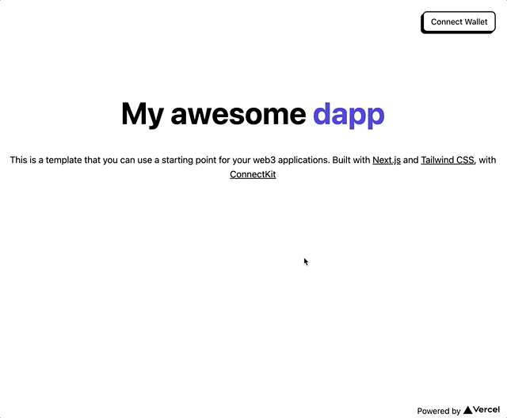

# Web3 starter

<p align="center"></p>

This is a template you can use to bootstrap a web3 project. Built with [Next.js](https://nextjs.org/), [TailwindCSS](https://tailwindcss.com), and [ConnectKit](https://docs.family.co/connectkit).

This project contains a landing page and a button to connect the user's wallet compatible with Metamask, Coinbase wallet,

## Getting Started

First, run the development server:

```bash
npm run dev
# or
yarn dev
```

Open [http://localhost:3000](http://localhost:3000) with your browser to see the result.

You can start editing the page by modifying `pages/index.tsx`. The page auto-updates as you edit the file.

[API routes](https://nextjs.org/docs/api-routes/introduction) can be accessed on [http://localhost:3000/api/hello](http://localhost:3000/api/hello). This endpoint can be edited in `pages/api/hello.ts`.

The `pages/api` directory is mapped to `/api/*`. Files in this directory are treated as [API routes](https://nextjs.org/docs/api-routes/introduction) instead of React pages.
